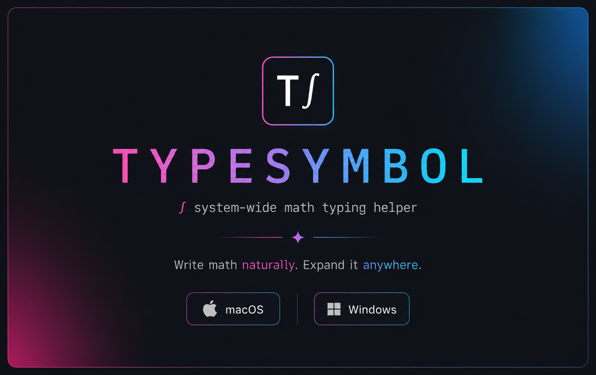
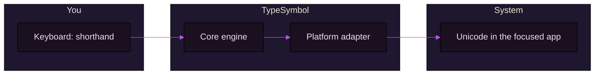

<div align="center">



<br/>

[](https://github.com/yazanmwk/TypeSymbol/releases)
[](LICENSE)

<br/>

[](docs/install.md)
[](docs/install.md)
[](docs/syntax-guide.md)
[](docs/CONTRIBUTING.md)
[](docs/SECURITY.md)

<br/>

<sub>System-wide math shorthand for macOS and Windows, with explicit controls for testing, toggling, and safe app-by-app behavior.</sub>

</div>

<br/>

# TypeSymbol

Type mathematical shorthand system-wide—`alpha` becomes `α`, `->` becomes `→`, and your formulas read like real math.

---

## See it in one glance

| You type (shorthand) | You get (Unicode) |
| :---: | :---: |
| `alpha -> beta` | **α → β** |
| `for all x in A` | **∀ x ∈ A** |
| `int 0 -> inf x` | **∫₀^∞ x dx** |
| `sum_(i=1)^n i^2` | **∑ᵢ₌₁ⁿ i²** |

*Transforms follow your [config](docs/install.md) (Greek, operators, integrals, sums, products, limits, transforms, set logic, probability/statistics, scripts, and more). Use `typesymbol test "..."` to preview any string.*

---

## What this is

TypeSymbol is a local, system-wide typing engine for math notation.

Instead of switching tools or opening symbol pickers, you keep typing in plain text and TypeSymbol expands it into Unicode math where you already work: notes, chats, docs, editors, and browsers.

It is built for one goal: reduce friction between thinking in math and writing in software.

---

## How it works



1. A **cross-platform Rust engine** parses and expands your math shorthand.  
2. A **background daemon** watches input so replacement can happen globally (not just inside one app).  
3. **macOS and Windows** each have a native adapter for capture and injection.

### Control surface (why the controls exist)

| Control | What it does | Why it matters |
| --- | --- | --- |
| `typesymbol on` / `typesymbol off` | Enable or pause global replacement instantly | You can safely switch contexts without uninstalling or editing config |
| `typesymbol daemon status` | Shows whether the background service is running | Quick health check when symbols are not appearing |
| `typesymbol config init` | Creates a local config with defaults | Gives you an explicit, editable baseline instead of hidden behavior |
| `typesymbol config show` | Prints the active config | Confirms which symbol families and triggers are currently active |
| `typesymbol test "..."` | Previews transforms without injecting into apps | Lets you validate rules before using them in live text fields |
| Trigger setting (`enter` / `ctrl-space`) | Chooses when replacement is applied | Balances speed vs control based on your typing style |
| Excluded apps list | Prevents replacement in selected apps | Avoids accidental transforms in terminals, editors, or sensitive inputs |

---

## Install

### Recommended (single path)

Install from the official TypeSymbol release channel:

```bash
# macOS
brew install yazanmwk/homebrew-tap/typesymbol
```

```powershell
# Windows
irm https://raw.githubusercontent.com/yazanmwk/TypeSymbol/main/scripts/install-windows-release.ps1 | iex
```

Verify:

```bash
typesymbol test "alpha -> beta"
typesymbol daemon status
```

All alternative install methods (manual assets, from source, troubleshooting) are in [docs/install.md](docs/install.md).

---

## Contribution policy

- Open source contributions are welcome (features, fixes, docs, tests).
- Maintainers handle all version tags and official releases.
- Pull requests do not publish release artifacts.

---

## Quick start

```bash
# Preview a transform without the daemon
typesymbol test "alpha -> beta"

# Config
typesymbol config init
typesymbol config show

# Daemon
typesymbol daemon status
```

## Syntax types supported

TypeSymbol covers the main math shorthand families below.

| Family | Examples you type | Output style |
| --- | --- | --- |
| **Core symbols** | `alpha`, `theta`, `pi`, `inf`, `->`, `<=`, `!=` | `α`, `θ`, `π`, `∞`, `→`, `≤`, `≠` |
| **Scripts & roots** | `x^10`, `x_i`, `a_1`, `sqrt(x)`, `sqrt x` | `x¹⁰`, `xᵢ`, `a₁`, `√(x)`, `√x` |
| **Calculus** | `int 0 -> inf x`, `sum_(i=1)^n`, `product from i = 1 to n of i`, `limit x to 0 of ...`, `partial/partial x ...` | `∫₀^∞ ...`, `∑...`, `∏...`, `lim...`, `∂/∂x ...` |
| **Transforms** | `laplace of f(t)`, `inverse laplace of F(s)`, `fourier transform of x(t)` | `ℒ{...}`, `ℒ⁻¹{...}`, `ℱ{...}` |
| **Sets & logic** | `for all x in A`, `there exists y not in B`, `subseteq`, `union`, `intersection` | `∀ x ∈ A`, `∃ y ∉ B`, `⊆`, `∪`, `∩` |
| **Probability & stats** | `probability of A|B`, `expected value of X`, `variance of X` | `P(A\|B)`, `E[X]`, `Var(X)` |
| **Natural language normalization** | `x power of 2` | `x²` |

<sub>Coverage is rule-based and configurable, so behavior stays predictable.</sub>

Complete syntax examples: [docs/syntax-guide.md](docs/syntax-guide.md)

---

## Why TypeSymbol

- **Keep flow state:** type plain shorthand and get math symbols without leaving your current app.
- **Work everywhere:** applies system-wide on macOS and Windows, not only inside one editor.
- **Stay in control:** explicit triggers, quick on/off, test mode, and per-app exclusions.
- **Trust the output:** deterministic rule-based transforms with config you can inspect and edit.

---

## Repository map

Only the main areas most contributors need:

```text
TypeSymbol/
├── crates/
│   ├── typesymbol-core/              # Parsing + transform engine
│   ├── typesymbol-config/            # Config model + defaults
│   ├── typesymbol-daemon/            # Runtime + input event pipeline
│   ├── typesymbol-platform-macos/    # Native macOS adapter
│   ├── typesymbol-platform-windows/  # Native Windows adapter
│   └── typesymbol-cli/               # CLI + TUI entrypoint
├── docs/                             # Install, syntax, release, security
├── scripts/                          # Install and packaging scripts
└── .github/workflows/                # CI and release automation
```

---

## Documentation

Index of all guides: **[docs/README.md](docs/README.md)**.

| Doc | What it’s for |
| --- | --- |
| [docs/install.md](docs/install.md) | Detailed install, PATH, and platform notes |
| [docs/CONTRIBUTING.md](docs/CONTRIBUTING.md) | Build from source, tests, and PR workflow |
| [docs/SECURITY.md](docs/SECURITY.md) | Responsible disclosure |
| [LICENSE](LICENSE) | MIT License |

---

## Security

Do not post suspected vulnerabilities in public issues first. See **[docs/SECURITY.md](docs/SECURITY.md)** for how to report them responsibly.

---

## Let's Connect

[](https://github.com/yazanmwk/TypeSymbol)
[](https://www.linkedin.com/in/yazanmwk/)
[](mailto:yazan.mw.k@gmail.com)
[](https://github.com/yazanmwk/TypeSymbol/issues)

---

<div align="center">

**[Releases](https://github.com/yazanmwk/TypeSymbol/releases)** · **[Contributing](docs/CONTRIBUTING.md)** · **[Security](docs/SECURITY.md)**

</div>
