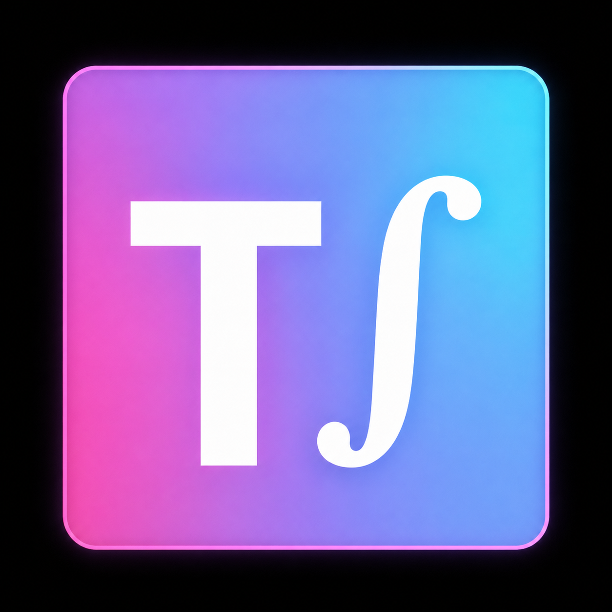
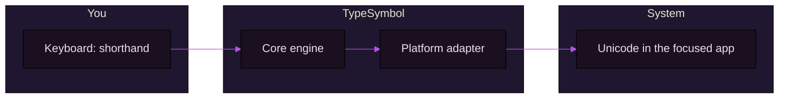

<div align="center">

<a href="https://github.com/yazanmwk/TypeSymbol">
  
</a>

<br/>

# TypeSymbol

**Type mathematical shorthand system-wide—`alpha` becomes `α`, `->` becomes `→`, and your formulas read like real math.**

**∫** *system-wide math typing helper* — matches the in-app title bar; the bar below is the same pink → lavender → cyan gradient the full-screen TUI uses for the ASCII “TYPE”/“SYMBOL” wordmark.

<br/>


<br/>

[](https://github.com/yazanmwk/TypeSymbol/releases)
[](https://github.com/yazanmwk/TypeSymbol/actions/workflows/release.yml)
[](https://github.com/yazanmwk/TypeSymbol/releases/latest)

<br/>

<sub>Rust core · global daemon · macOS & Windows · CLI + TUI: ∫ prompt, <code>╭╮╰╯</code> panels, violet borders, gradient header</sub>

</div>

<br/>

## See it in one glance

| You type (shorthand) | You get (Unicode) |
| :---: | :---: |
| `alpha -> beta` | **α → β** |
| `for all x in A` | **∀ x ∈ A** |
| `int 0 -> inf x` | **∫₀^∞ x dx** |
| `sum_(i=1)^n i^2` | **∑ᵢ₌₁ⁿ i²** |

*Transforms follow your [config](docs/install.md) (Greek, operators, integrals, sums, and more). Use `typesymbol test "..."` to preview any string.*

---

## How it works



1. A **cross-platform Rust engine** parses and expands your math shorthand.  
2. A **background daemon** watches input so replacement can happen globally (not just inside one app).  
3. **macOS and Windows** each have a native adapter for capture and injection.

---

## Install

### Windows (GitHub installer - recommended)

```powershell
irm https://raw.githubusercontent.com/yazanmwk/TypeSymbol/main/scripts/install-windows-release.ps1 | iex
```

Then open a new terminal and verify:

```powershell
typesymbol test "alpha -> beta"
typesymbol daemon status
```

Update later with:

```bash
typesymbol update check
typesymbol update
```

Default CLI interface (Windows): run `typesymbol` with no arguments to open the interactive command shell.
Common commands in that shell: `on`, `off`, `daemon status`, `config show`, `help`, `exit`.

If Windows reports `VCRUNTIME140.dll` missing, install the VC++ Redistributable (x64) from [Microsoft](https://aka.ms/vs/17/release/vc_redist.x64.exe), then run `typesymbol` again.

Security-first option (review before running):

```powershell
Invoke-WebRequest https://raw.githubusercontent.com/yazanmwk/TypeSymbol/main/scripts/install-windows-release.ps1 -OutFile install-typesymbol.ps1
Get-Content .\install-typesymbol.ps1
.\install-typesymbol.ps1
```

Version-pinned install:

```powershell
& ([scriptblock]::Create((irm https://raw.githubusercontent.com/yazanmwk/TypeSymbol/main/scripts/install-windows-release.ps1))) -Version 0.1.0
```

Manual install from release assets is also supported:

1. Download `typesymbol-vX.Y.Z-x86_64-pc-windows-msvc.zip` from [Releases](https://github.com/yazanmwk/TypeSymbol/releases).
2. Verify it with `checksums.txt`.
3. Extract `typesymbol.exe` into a folder on your `PATH` (for example `%USERPROFILE%\bin`).

### macOS (Homebrew — recommended)

If you use [Homebrew](https://brew.sh/):

```bash
brew tap yazanmwk/homebrew-tap
brew install typesymbol
```

(One line: `brew install yazanmwk/homebrew-tap/typesymbol`.)

Tap and automation: [docs/homebrew-tap.md](docs/homebrew-tap.md).

### macOS (from source)

Build and install with the script (Xcode CLT, Rust, and binary under `~/.local/bin`):

```bash
chmod +x scripts/install-macos.sh
./scripts/install-macos.sh
typesymbol
```

### Windows (from source)

```powershell
Set-ExecutionPolicy -Scope Process Bypass
.\scripts\install-windows.ps1
typesymbol
```

*PATH tips and VM notes: [docs/install.md](docs/install.md).*

---

## Quick start

```bash
# Preview a transform without the daemon
typesymbol test "alpha -> beta"

# Config
typesymbol config init
typesymbol config show

# Daemon
typesymbol daemon status
```

---

## Why TypeSymbol

| | |
| --- | --- |
| **System-wide** | Works across apps—not a plugin for a single editor. |
| **Fast core** | Parser and rules run in Rust. |
| **Hackable** | Config-driven rules; CLI + TUI for inspection and control. |
| **Ships cleanly** | Automated [releases](docs/releasing.md): signed source history, reproducible binary assets + checksums, and [Homebrew tap](docs/homebrew-tap.md). |

---

## Repository map

Rust crates live under `crates/`. Top level keeps docs, packaging, scripts, and CI.

| Crate / area | Role |
| --- | --- |
| `crates/typesymbol-core` | Parser, formatter, rule engine |
| `crates/typesymbol-config` | Config model, load/save, defaults |
| `crates/typesymbol-daemon` | Runtime and event pipeline |
| `crates/typesymbol-platform-macos` | macOS input & replacement |
| `crates/typesymbol-platform-windows` | Windows input & replacement |
| `crates/typesymbol-cli` | CLI and TUI entrypoint |
| `docs/` | Install guides, releasing, security, PRD |
| `scripts/` | Installers and packaging helpers |
| `.github/workflows/` | Release and Homebrew automation |

---

## Documentation

Index of all guides: **[docs/README.md](docs/README.md)**.

| Doc | What it’s for |
| --- | --- |
| [docs/install.md](docs/install.md) | Detailed install, PATH, and platform notes |
| [docs/releasing.md](docs/releasing.md) | Cutting a version and release artifacts |
| [docs/homebrew-tap.md](docs/homebrew-tap.md) | Homebrew tap |
| [docs/CONTRIBUTING.md](docs/CONTRIBUTING.md) | Build from source, tests, packaging overrides for forks |
| [docs/PRD.md](docs/PRD.md) | Product requirements (vision and goals) |
| [docs/SECURITY.md](docs/SECURITY.md) | Responsible disclosure |
| [LICENSE](LICENSE) | MIT License |

---

## Security

Do not post suspected vulnerabilities in public issues first. See **[docs/SECURITY.md](docs/SECURITY.md)** for how to report them responsibly.

---

<div align="center">

**[Releases](https://github.com/yazanmwk/TypeSymbol/releases)** · **[Issues](https://github.com/yazanmwk/TypeSymbol/issues)**

</div>
