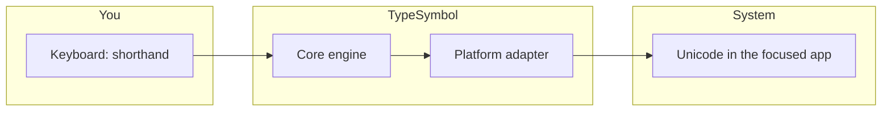

<div align="center">

# TypeSymbol

**Type mathematical shorthand system-wide—`alpha` becomes `α`, `->` becomes `→`, and your formulas read like real math.**

<br/>

[](https://github.com/yazanmwk/TypeSymbol/releases)
[](https://github.com/yazanmwk/TypeSymbol/actions/workflows/release.yml)
[](https://github.com/yazanmwk/TypeSymbol#install)

<br/>

<sub>Rust core · global daemon · macOS & Windows · CLI + terminal UI</sub>

</div>

<br/>

## See it in one glance

| You type (shorthand) | You get (Unicode) |
| :---: | :---: |
| `alpha -> beta` | **α → β** |
| `for all x in A` | **∀ x ∈ A** |
| `int 0 -> inf x` | **∫₀^∞ x dx** |
| `sum_(i=1)^n i^2` | **∑ᵢ₌₁ⁿ i²** |

*Transforms follow your [config](INSTALL.md) (Greek, operators, integrals, sums, and more). Use `typesymbol test "..."` to preview any string.*

---

## How it works



1. A **cross-platform Rust engine** parses and expands your math shorthand.  
2. A **background daemon** watches input so replacement can happen globally (not just inside one app).  
3. **macOS and Windows** each have a native adapter for capture and injection.

---

## Install

### Windows (fastest)

```powershell
winget install --id yazanmwk.TypeSymbol
```

Then open a new terminal and run `typesymbol`.

### macOS (from source installer)

```bash
chmod +x scripts/install-macos.sh
./scripts/install-macos.sh
typesymbol
```

### Windows (from source)

```powershell
Set-ExecutionPolicy -Scope Process Bypass
.\scripts\install-windows.ps1
typesymbol
```

*PATH tips and VM notes: [INSTALL.md](INSTALL.md).*

---

## Quick start

```bash
# Preview a transform without the daemon
typesymbol test "alpha -> beta"

# Config
typesymbol config init
typesymbol config show

# Daemon
typesymbol daemon status
```

---

## Why TypeSymbol

| | |
| --- | --- |
| **System-wide** | Works across apps—not a plugin for a single editor. |
| **Fast core** | Parser and rules run in Rust. |
| **Hackable** | Config-driven rules; CLI + TUI for inspection and control. |
| **Ships cleanly** | Automated [releases](RELEASING.md): GitHub binaries, [WinGet](WINGET_SETUP.md), and [Homebrew tap](HOMEBREW_TAP_SETUP.md) workflows. |

---

## Repository map

| Crate / area | Role |
| --- | --- |
| `typesymbol-core` | Parser, formatter, rule engine |
| `typesymbol-config` | Config model, load/save, defaults |
| `typesymbol-daemon` | Runtime and event pipeline |
| `typesymbol-platform-macos` | macOS input & replacement |
| `typesymbol-platform-windows` | Windows input & replacement |
| `typesymbol-cli` | CLI and TUI entrypoint |
| `scripts/` | Installers and packaging helpers |
| `.github/workflows/` | Release, WinGet, Homebrew automation |

---

## Documentation

| Doc | What it’s for |
| --- | --- |
| [INSTALL.md](INSTALL.md) | Detailed install, PATH, and platform notes |
| [RELEASING.md](RELEASING.md) | Cutting a version and release artifacts |
| [WINGET_SETUP.md](WINGET_SETUP.md) | WinGet package maintenance |
| [HOMEBREW_TAP_SETUP.md](HOMEBREW_TAP_SETUP.md) | Homebrew tap |
| [CONTRIBUTING.md](CONTRIBUTING.md) | Build from source, tests, packaging overrides for forks |
| [docs/PRD.md](docs/PRD.md) | Product requirements (vision and goals) |
| [SECURITY.md](SECURITY.md) | Responsible disclosure |
| [LICENSE](LICENSE) | MIT License |

---

## Security

Do not post suspected vulnerabilities in public issues first. See **[SECURITY.md](SECURITY.md)** for how to report them responsibly.

---

<div align="center">

**[Releases](https://github.com/yazanmwk/TypeSymbol/releases)** · **[Issues](https://github.com/yazanmwk/TypeSymbol/issues)**

</div>
